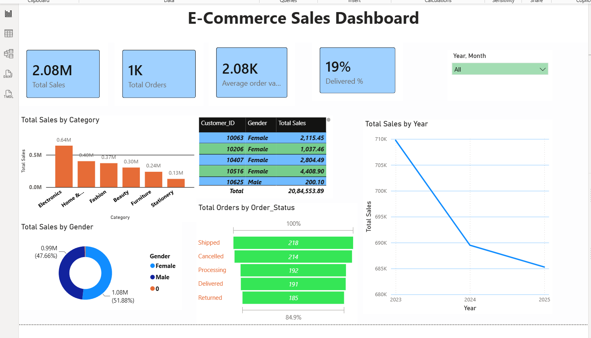

# Ecommerce Sales Dashboard

## 📊 Project Overview
This project analyzes a 50,300-row Ecommerce dataset to identify key business insights using SQL for data analysis and Power BI for interactive visualization. The goal is to help stakeholders understand sales performance, customer behavior, and revenue trends.

## 🛠️ Tools & Technologies Used
- **SQL**: MySQL Workbench for data querying and KPI calculation
- **Power BI**: For interactive dashboard and data visualization
- **Excel**: For initial data cleaning and preparation
- **GitHub**: For project documentation and version control

## 📁 Dataset
- `ecommerce_messy_50300_rows.csv`: Raw dataset
- `ecommerce_dataset_cleaned2.csv`: Cleaned dataset used for analysis

## 📈 Key Insights from SQL Analysis
1.  **KPI Summary**: Total Revenue, Total Orders, Total Customers, and Average Order Value
2.  **Top Performing Categories**: Identified top 5 categories driving maximum revenue
3.  **Top 5 Cities**: Geographical analysis to find highest revenue-generating cities
4.  **Monthly Sales Trend**: Revenue trend over time to identify seasonality
5.  **Regional Performance**: Revenue and Profit breakdown by Region
6.  **Payment Method Analysis**: Most preferred payment methods by customers
7.  **Order Status Distribution**: Percentage of Delivered, Cancelled, and Returned orders

## 📊 Power BI Dashboard
The interactive dashboard includes:
- KPI Cards for overall metrics
- Bar chart for Top Categories and Top Cities
- Line chart for Monthly Sales Trend
- Pie chart for Payment Method and Order Status distribution
- Map/Region wise sales visualization

## 🔗 How to Use
1.  Download `ecommerce_dataset_cleaned2.csv` and import into MySQL
2.  Run queries from `queries.sql` to reproduce analysis
3.  Open `ecommerce_project.pbix` in Power BI Desktop to view the dashboard

## 👨‍💻 Author
**macharlarohithreddy**
